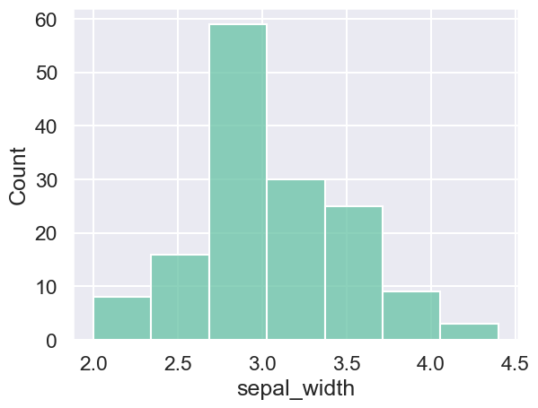

import Colab from "../../../src/components/Colab/Colab";

# Matplotlib & Seaborn

今回学ぶライブラリーは、MatplotlibとSeabornです。
ともに、データの可視化を行うためのライブラリーです。
データの可視化はEDAを行う上で欠かせないものです。

散布図や箱ひげ図といった基本的なグラフを説明していきます。

これから実装するコードは、以下のGoogle Colaboratoryで確認出来ます。このページに記載紹介されているが、コードの例がないものは、Colaboratoryのリンクを参照してください。

<Colab url="https://colab.research.google.com/github/Yokomi422/Practical-Machine-Learning/blob/main/docs/00-python-libraries-intro/03matlotlib/01colab.ipynb" />

## ヒストグラム

ヒストグラムは、データの分布を表すグラフです。
データの分布を知ることは、データの特徴を知る上で重要です。

今回は、irisというデータセットを使用します。

:::tip irisデータセット
irisデータセットは、機械学習の分野でよく使用されるデータセットです。
sepal_length（ガクの長さ）、sepal_width（ガクの幅）、petal_length（花弁の長さ）、petal_width（花弁の幅）の4つのデータからspecies（種類）を予測します。
:::

```python
df = sns.load_dataset("iris")
df.head()
```

| sepal_length | sepal_width | petal_length | petal_width | species |
| ------------ | ----------- | ------------ | ----------- | ------- |
| 5.1          | 3.5         | 1.4          | 0.2         | setosa  |
| 4.9          | 3.0         | 1.4          | 0.2         | setosa  |
| 4.7          | 3.2         | 1.3          | 0.2         | setosa  |
| 4.6          | 3.1         | 1.5          | 0.2         | setosa  |
| 5.0          | 3.6         | 1.4          | 0.2         | setosa  |

### シンプルなヒストグラム

```python
sns.histplot(df["sepal_width"], kde=False, bins=7)
```



- `kde`はカーネル密度推定を行うかどうかを指定します。kdeは確率密度関数を推定する手法の一つです。
- `bins`はヒストグラムの棒の数を指定します。

:::tip スタージェスの公式
ヒストグラムのbinの個数は、データの特徴に合わせて決める必要があります。
ただ、スタージェスの公式を用いると、データの個数から適切なbinの個数を推定することが出来ます。

$$
k = 1 + log_2(n)
$$

- $k$はbinの個数
- $n$はデータの個数
  :::

```python

```
