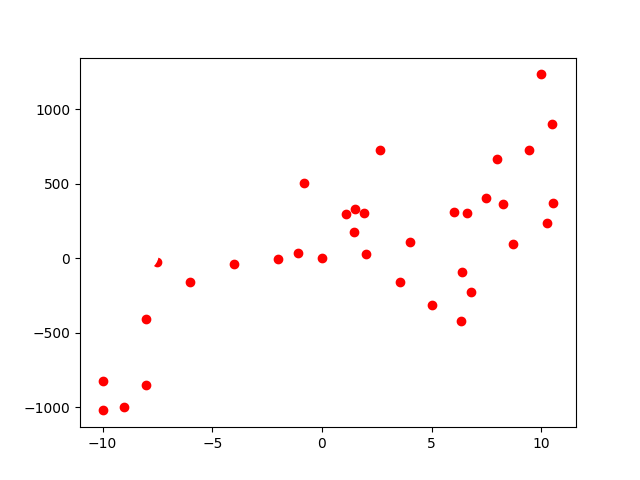
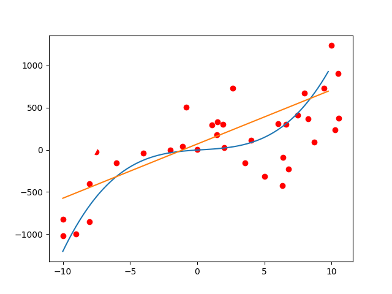

# 多項式回帰(Polynomial Regression)

## 多項式回帰とは

前の章では線形回帰を扱いましたが、線形性を持ったモデルはわかりやすい一方、複雑なデータに対しては適合しづらいという問題があります。
例えば、以下の散布図は、線形回帰(一次関数)よりも、多項式回帰(三次関数)を使った方が、より適切に関係を表せそうです。



そこで、線形回帰の拡張として、多項式回帰を考えます。

多項式回帰は、以下のように目的変数が説明変数を多項式で表現できると仮定しています。

$$
\hat{y} = θ_0 + θ_1 x_1 + θ_2 x_2^2 + ... + θ_n x_n^n
$$

上の散布図に、多項式回帰と線形回帰を適用すると、以下のようになります。



直線よりも、曲線の方がデータに適合していることがわかります。

:::tip　tips
多項式回帰は非線形モデルで、線形モデルに比べて複雑なデータに対して適切に適合できるというメリットがあります。
一方で、過学習に陥りやすいというデメリットもあります。次数は適切に選ぶ必要があります。
:::

早速、多項式回帰を実装してみましょう。今回も、損失関数は平均二乗誤差を使います。
目的変数yが、説明変数xの多項式で表現できると仮定して、以下のようにモデルを定義します。
$$
\hat{y_i} = a + b x_i + c x_i^2 + d x_i^3
$$

xが最もyを説明できるときのa, b, c, dを求めることが、多項式回帰の目的です。

線形回帰のときと同様に、損失関数を最小化するようにパラメータを更新していきます。

$$
MSE = \frac{1}{n} \sum_{i=1}^{n} (y_i - (a + b x_i + c x_i^2 + d x_i^3))^2
$$

a,b,c,dについてそれぞれ、偏微分してすると、
$$
\frac{\partial MSE}{\partial a} = \frac{2}{n} \sum_{i=1}^{n} (y_i - (a + b x_i + c x_i^2 + d x_i^3))(-1) \\
\frac{\partial MSE}{\partial b} = \frac{2}{n} \sum_{i=1}^{n} (y_i - (a + b x_i + c x_i^2 + d x_i^3))(-x_i) \\
\frac{\partial MSE}{\partial c} = \frac{2}{n} \sum_{i=1}^{n} (y_i - (a + b x_i + c x_i^2 + d x_i^3))(-x_i^2) \\
\frac{\partial MSE}{\partial d} = \frac{2}{n} \sum_{i=1}^{n} (y_i - (a + b x_i + c x_i^2 + d x_i^3))(-x_i^3)
$$

となり、4つのパラメータについて、4つの式が得られるので、連立方程式を解くことで、a,b,c,dを求めることができます。
このように多項式回帰は、線形回帰と全く同様に、解析的に解くことができます。

:::tip 解析的に解くとは
方程式を解くことで、一意に解を求めることです。
対義語として、近似的に解くという言葉があります。近似的に解くとは、説明変数が多かったり特徴量行列が正則出なかったりして、解析的に解くことができない場合に、数値計算を用いて、近似的に解を求めることです。

:::

## 多項式回帰分析の実装
上では多項式回帰をスクラッチで実装しましたが、実際にはscikit-learnというライブラリを使うことで簡単に実装することができます。
以下のコードを実行してみましょう。

```python
from sklearn.linear_model import LinearRegression
from sklearn.preprocessing import PolynomialFeatures

# データの生成
np.random.seed(0)
x = 2 - 3 * np.random.normal(0, 1, 20)
y = x - 2 * (x ** 2) + 0.5 * (x ** 3) + np.random.normal(-3, 3, 20)

# xを2Dにリシェイプ
x = x[:, np.newaxis]
y = y[:, np.newaxis]

# 2次の多項式特徴を生成
polynomial_features = PolynomialFeatures(degree=2)

# 変換器をデータに適合させ、データを変換
x_poly = polynomial_features.fit_transform(x)

# 線形回帰モデルを生成
model = LinearRegression()

# モデルをデータに適合
model.fit(x_poly, y)

# モデルを使用して予測
y_pred = model.predict(x_poly)

```
