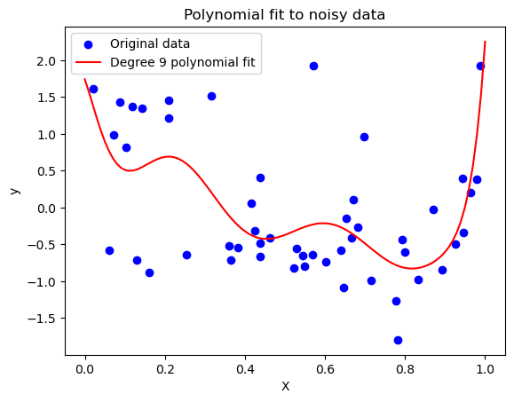
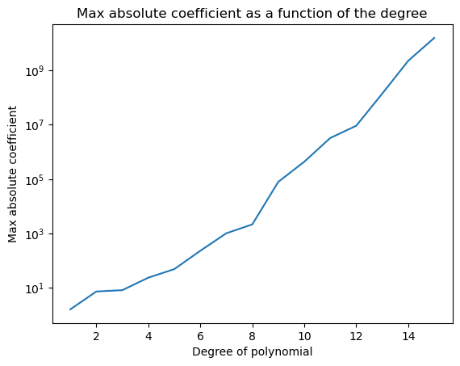
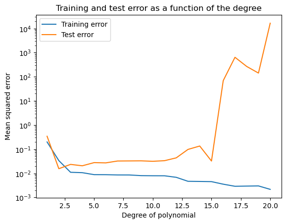

import LikeLine from "./LikeLine"
import Colab from "../../../src/components/Colab/Colab"

# 多項式回帰(Polynomial Regression)

## 多項式回帰とは

前の章では線形回帰を扱いましたが、線形性を持ったモデルはわかりやすい一方、複雑なデータに対しては適合しづらいという問題があります。
例えば、以下の散布図は、線形回帰(一次関数)よりも、多項式回帰(三次関数)を使った方が、より適切に関係を表せそうです。

そこで、線形回帰の拡張として、多項式回帰を考えます。

多項式回帰は、以下のように目的変数が説明変数を多項式で表現できると仮定しています。

$$
\hat{y} = θ_0 + θ_1 x + θ_2 x^2 + ... + θ_n x^n
$$
上の散布図に、多項式回帰と線形回帰を適用すると、以下のようになります。

直線よりも、曲線の方がデータに適合していることがわかります。

:::tip　tips
多項式回帰は非線形モデルで、線形モデルに比べて複雑なデータに対して適切に適合できるというメリットがあります。
一方で、過学習に陥りやすいというデメリットもあります。次数は適切に選ぶ必要があります。
:::

今回も、損失関数に平均二乗誤差を用いて、損失関数を最適化していきます。
目的変数yが、説明変数xの多項式で表現できると仮定して、以下のようにモデルを定義します。
$$
\hat{y_i} = a + b x_i + c x_i^2 + d x_i^3
$$

xが最もyを説明できるときのa, b, c, dを求めることが、多項式回帰の目的です。

線形回帰のときと同様に、損失関数を最小化するようにパラメータを更新していきます。

$$
MSE = \frac{1}{n} \sum_{i=1}^{n} (y_i - (a + b x_i + c x_i^2 + d x_i^3))^2
$$

a,b,c,dについてそれぞれ、偏微分してすると、
$$
\frac{\partial MSE}{\partial a} = \frac{2}{n} \sum_{i=1}^{n} (y_i - (a + b x_i + c x_i^2 + d x_i^3))(-1) \\
\frac{\partial MSE}{\partial b} = \frac{2}{n} \sum_{i=1}^{n} (y_i - (a + b x_i + c x_i^2 + d x_i^3))(-x_i) \\
\frac{\partial MSE}{\partial c} = \frac{2}{n} \sum_{i=1}^{n} (y_i - (a + b x_i + c x_i^2 + d x_i^3))(-x_i^2) \\
\frac{\partial MSE}{\partial d} = \frac{2}{n} \sum_{i=1}^{n} (y_i - (a + b x_i + c x_i^2 + d x_i^3))(-x_i^3)
$$

となり、4つのパラメータ(a,b,c,d)について、4つの式が得られるので、連立方程式を解くことで、a,b,c,dを求めることができます。
このように多項式回帰は、線形回帰と全く同様に、解析的に解くことができます。

:::tip 解析的に解くとは
方程式を解くことで、一意に解を求めることです。
対義語として、近似的に解くという言葉があります。近似的に解くとは、説明変数が多かったり特徴量行列が正則出なかったりして、解析的に解くことができない場合に、数値計算を用いて、近似的に解を求めることです。
:::

<LikeLine props="多項式回帰の一般形" />

## 多項式回帰分析の実装

多項式回帰分析を実装していきます。

Pythonのコードの実行結果は、以下のGoogle Colaboratoryで確認することができます。

<Colab url="https://colab.research.google.com/github/Yokomi422/Practical-Machine-Learning/blob/main/docs/01-Machine-learning-algorithms/02-polynomial-regression/colab02.ipynb" />

## 過学習しやすい多項式回帰

多項式回帰は、線形回帰よりも複雑なデータに対して適切に適合できるというメリットがあります。しかし、その一方で、過学習に陥りやすいというデメリットもあります。

では、具体的に多項式回帰が過学習しやすいというのは、どういうことなのでしょうか。直感的には、次数が多い場合はその分曲線がグネグネできるということです。つまり、曲線は外れ値に対しても、曲がって合わせようとします。
以下のグラフを見てください。これは次数が9の多項式回帰を適用した結果です。

このグラフを見て分かるように、次数が高いと、曲線がグネグネして、外れ値に対しても曲がって合わせようとします。これが、過学習に陥りやすいということです。

グネグネ曲がるとは、数学的にはどういうことでしょうか。

上のグラフは、次数が増加するにつれて、係数がどれくらい大きくなっていくかを表しています。次数が増加するにつれて、係数がどんどん大きくなっていくことが分かります。つまり、次数が増加するにつれて、曲線がどんどんグネグネになっていくということです。

次に、次数が大きくなるにつれて、精度はどうなっていくかを見てみましょう。

縦軸にMSEを取り、横軸に次数を取りました。次数が増加するにつれて、訓練データの精度は上昇していくものの、逆にテストデータの精度は字数の増加につれて大幅に減少していることがわかると思います。つまり、次数が増加するにつれて、過学習が起きているということです。

多項式回帰は次数の増加に伴い、係数が爆発的に増加してしますことが、過学習してしまうことがわかりましたが、係数の増加を抑えることができたら、過学習を抑えることができるのではないかと考えられます。そのよう回帰を次で紹介します。
以下は、発展的な内容になりますので、興味がある方のみ読んでください。

## Lasso回帰

## Ridge回帰