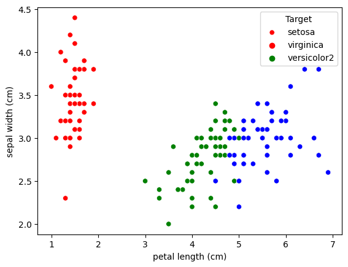

# k-最近傍法(k-NN)

## k-NNの概要

k-最近傍法(k-NN)は、分類問題における教師あり学習の手法の一つです。
以下では、[irisの分類](https://scikit-learn.org/stable/auto_examples/datasets/plot_iris_dataset.html)を例に説明します。

:::tip irisの分類
アイリスデータセットは、アイリス（Iris）という花の3種類（Iris setosa、Iris virginica、Iris versicolor）の各50サンプルからなります。
各サンプルは、ガクの長さ（Sepal length）、ガクの幅（Sepal width）、花弁の長さ（Petal length）、花弁の幅（Petal width）の4つの特徴量を持ちます。
これらの特徴量から、アイリスの種類を分類します。
:::

新しいサンプルが与えられたときに、そのサンプルがどのアイリスに属するかを予測することを考えます。
k-NNでは、新しいサンプルに最も近いk個のサンプルのアイリスの種類を多数決で決めます。
最も単純な$k = 1$の場合を考えてみましょう。



$k = 1$の場合、新しいサンプルは他のサンプルのうち、最も近いサンプルのアイリスの種類を持つと予測されます。
$k > 1$の場合は、最も近い$k$個のサンプルのアイリスの種類を多数決で決めます。

## 実装

k-NNの概要がわかったところで、scikit-learnを使って実装してみましょう。
今回は、k = 5で実装します。
上と同様に、irisの分類を使用します。

##### ライブラリのインポート

```python
from sklearn.datasets import load_iris
from sklearn.model_selection import train_test_split
from sklearn.neighbors import KNeighborsClassifier
from sklearn.metrics import accuracy_score
```

##### データの読み込み

```python
iris = load_iris()
X = iris.data
y = iris.target
```

#### 学習データとテストデータに分割

```python
X_train, X_test, y_train, y_test = train_test_split(X, y, test_size=0.3, random_state=42)
```

#### モデルの学習

```python
knn = KNeighborsClassifier(n_neighbors=5)
knn.fit(X_train, y_train)
```

#### テストデータの予測

```python
y_pred = knn.predict(X_test)
```

#### 精度の評価

```python
accuracy = accuracy_score(y_test, y_pred)
print('accuracy: {:.2f}'.format(accuracy))
```

- accuracy: 0.97となりました。
